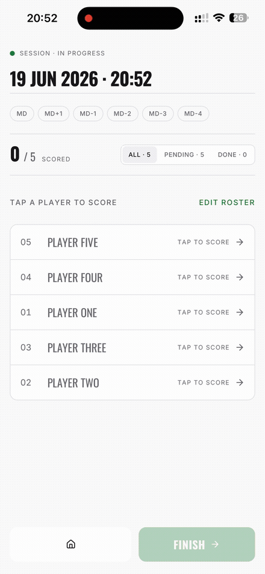

# RPE Tracker

Offline-first PWA for coaches to collect post-training workload ratings 
(RPE 1–10) from players. Works fully without internet — all data lives 
in the browser via IndexedDB.

**🔗 [Live demo](https://rpe-shka.vercel.app)**

## Why local-first

Coaches collect ratings pitch-side, where connectivity is unreliable. 
The app is built offline-first: every action works without a network, 
data persists locally in IndexedDB (via Dexie.js), and the PWA is 
installable on a phone like a native app.

## Features
- Session & roster management
- Per-player RPE rating capture (1–10)
- Results view with workload aggregation
- Fully offline, installable as PWA
- Export to .xlsx file

## Architecture

Vertical Slice Architecture — each slice (`record-rpe`, `view-results`, 
`manage-session`, `manage-roster`) is self-contained with its own 
UI / model / queries / mutations. Adding a feature touches one slice, 
not the whole codebase.

## Tech stack
Vite · React 19 · TypeScript · TanStack Router · Dexie.js (IndexedDB) · 
Tailwind CSS v4 · vite-plugin-pwa · Vitest
